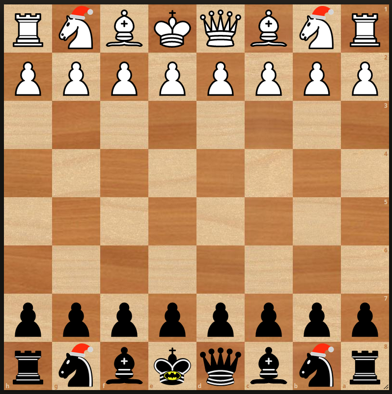

# Lichess overlay for funny knights

I have made this Firefox CSS customization that I use for Lichess with
the cburnet pieces, feel free to use it too.

To use it, you need to enable FirefoxCSS customizations. This is described
on the [Reddit Firefox CSS Guide](https://www.reddit.com/r/FirefoxCSS/wiki/index/tutorials/).

In short, you will have to:

* Enable stylesheet customizations: `toolkit.legacyUserProfileCustomizations.stylesheets` set to `true` in `about:config`
* Locate your profile folder in `about:support`
* Create a `chrome` directory in the profile folder if it does not exist.
* Create files name `userContent.css` and `userContent.css` in the `chrome` directory.
* Copy the `userContent.css` content from this repo in your `userContent.css`

Images are base64 encoded in the CSS file. You can select only the knights
or black king customizations if you like only one of them.

At the end, it looks like this:

.

## Modify the images/assets

If you want to make derivative, feel free to take from the assets folder
and modify them. I started from the SVG, generated a large PNG that I then
modified in GIMP

When you have the PNG available, you can base64 encode it and update the CSS file.
For example:

```console
lichess_css> base64 assets/black_king.png
```

Then take the output that you assign in the userContent.css
